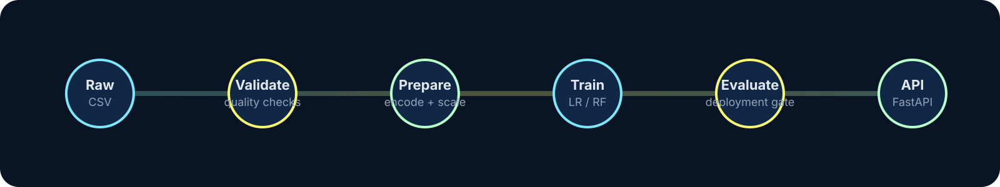
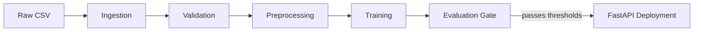

# MLOps Pipeline: Customer Churn Prediction

<p align="center">
	
</p>

<p align="center">
	End-to-end churn prediction pipeline with automated ingestion, validation, preprocessing, training, evaluation, and FastAPI deployment.
</p>

<p align="center">
	
	
	
	
</p>

<p align="center">
	
</p>

## What this project does

This repository packages a simple but complete machine learning delivery loop for Telco churn prediction. The pipeline ingests raw customer data, validates it, preprocesses categorical and numeric features, trains two candidate classifiers, selects the best model by F1 score, and serves the winner behind a FastAPI service.

## Pipeline at a glance



## Features

- Automated data validation for missing values and duplicates.
- Consistent preprocessing with label encoding and standard scaling.
- Model comparison between Logistic Regression and Random Forest.
- Metric persistence to JSON for reproducible evaluation.
- FastAPI inference service with health and metrics endpoints.
- Dockerized runtime for a portable deployment path.

## Tech Stack

| Layer | Tools |
| --- | --- |
| Language | Python 3.10 |
| Data | pandas |
| Machine Learning | scikit-learn |
| API | FastAPI, Uvicorn |
| Packaging | pickle, JSON |
| Containerization | Docker |
| Testing | pytest |
| CI/CD | GitHub Actions |

## Repository Layout

```text
mlops-pipeline/
├── data/
│   ├── raw/            # Telco-Customer-Churn.csv
│   └── processed/
├── models/             # Trained models and metrics artifacts
├── src/
│   ├── ingestion.py    # Load raw data
│   ├── validation.py   # Validate schema and quality
│   ├── preprocessing.py# Encode and scale features
│   ├── train.py        # Train candidate models and save metrics
│   ├── evaluate.py     # Gate deployment on thresholds
│   └── deploy.py       # FastAPI app
├── tests/
│   └── test_validation.py
├── Dockerfile
├── requirements.txt
└── README.md
```

## Getting started

### 1. Create an environment

```bash
python -m venv venv
venv\Scripts\activate
pip install -r requirements.txt
```

### 2. Run the pipeline locally

```bash
python src/ingestion.py
python src/validation.py
python src/preprocessing.py
python src/train.py
python src/evaluate.py
```

### 3. Start the API

```bash
uvicorn src.deploy:app --reload
```

## API

Base URL: `http://127.0.0.1:8000`

- `GET /health` returns the service status and active model name.
- `GET /metrics` returns the saved metrics for all trained models.
- `POST /predict` returns churn prediction and probability.

Example request:

```bash
curl -X POST "http://127.0.0.1:8000/predict" ^
	-H "Content-Type: application/json" ^
	-d "{\"gender\":\"Female\",\"SeniorCitizen\":0,\"Partner\":\"Yes\",\"Dependents\":\"No\",\"tenure\":12,\"PhoneService\":\"Yes\",\"MultipleLines\":\"No\",\"InternetService\":\"DSL\",\"OnlineSecurity\":\"No\",\"OnlineBackup\":\"Yes\",\"DeviceProtection\":\"No\",\"TechSupport\":\"No\",\"StreamingTV\":\"Yes\",\"StreamingMovies\":\"No\",\"Contract\":\"Month-to-month\",\"PaperlessBilling\":\"Yes\",\"PaymentMethod\":\"Electronic check\",\"MonthlyCharges\":70.35,\"TotalCharges\":1394.55}"
```

## Docker

```bash
docker build -t churn-api .
docker run -p 8000:8000 churn-api
```

## Testing

```bash
pytest tests/ -v
```

## Data

The sample dataset is the IBM Telco Customer Churn dataset, with 7,043 customers and 21 input features. The model uses `Churn` as the binary target and stores preprocessing artifacts under `models/`.

## CI/CD

GitHub Actions runs on every push and installs dependencies before executing the test suite. The workflow is intentionally minimal so it is easy to extend with linting, build checks, and deployment steps.

## Notes

- The deployment service loads artifacts from `models/` at startup, so train the pipeline before launching the API.
- The evaluation step uses default thresholds of accuracy >= 0.75 and F1 >= 0.50.

## License

MIT